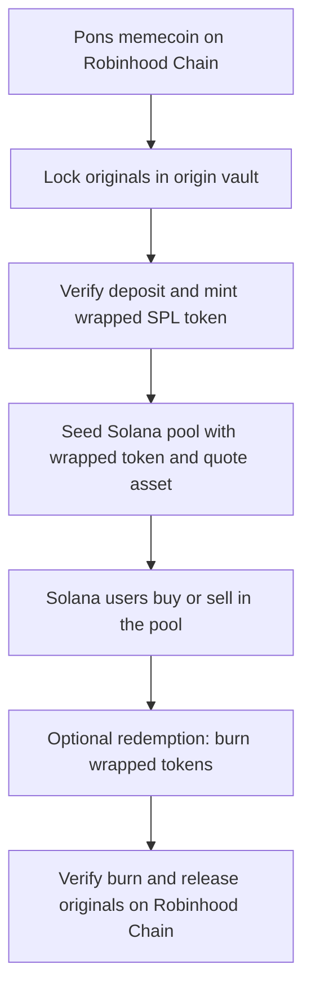

<p align="center">
  
</p>

<h1 align="center">Pons Warp</h1>

<p align="center"><strong>Robinhood-born memes. Solana-native markets.</strong></p>
<p align="center"><code>Pons / Robinhood Chain ↔ Warp ↔ Solana pools</code></p>

---

> **Pons Warp** is a proposed asset transport and market infrastructure for memecoins launched on Pons on Robinhood Chain. An eligible original token is locked at origin; a corresponding wrapped SPL token is minted on Solana against that locked balance. Solana traders can buy and sell the wrapped token in Solana liquidity pools. Burning it starts a redemption of the original asset on Robinhood Chain.
>
> **$WARP** is the proposed Solana-native coordination token for asset onboarding, operator bonds and protocol fees. It is distinct from every wrapped memecoin. Holding $WARP does not itself represent a claim on any bridged asset.

| Token overview | Details |
|---|---|
| Project | Pons Warp |
| Native Test Token | `$WARP` on Solana |
| Native Test Mint | 64tUZQBCDKhkxPYNey9PXdV8Hz36ra28FuDhMMULpump |
| Product | Wrapped representations of eligible Pons-origin tokens in Solana pools |
| Canonical token location | Robinhood Chain |
| Wrapped token location | Solana; one unique mint per registered source asset |
| Wrapped Subdomain | warp.ponsfamily.com |
| User entry point | Solana wallet and pool, without requiring a Robinhood Chain wallet for a Solana-only trade |
| Redemption | Burn wrapped units on Solana, release the corresponding original units to a Robinhood Chain address |
| Image | `warp.jpg` beside this Markdown file |
| Deployment status | Architecture proposal; no live bridge, token mint, pool or Pons integration is asserted |
| Canonical Test wPons | HxNzaehXN56aJSF2yHRA3Wbxmav9QyvgtwJDZSmMpump |

---

# How Warp Works



**Pool trading is immediate at the Solana pool's available liquidity; origin redemption is a separate cross-chain operation with its own finality, fees and waiting time.** A swap does not require the trader to bridge personally. The pool needs real inventory of wrapped tokens and the paired quote asset before anyone can buy.

---

# Summary

Pons launches a memecoin on Robinhood Chain. Warp lists the token's verified source contract and assigns it one Solana wrapped mint, such as `wPONS-ABC`. A market maker or liquidity provider locks originals, receives wrapped units, and deposits wrapped units plus SOL or a stablecoin into a Solana pool. A user with a Solana wallet can now acquire exposure by swapping through that pool. A holder who wants the original token burns wrapped units and claims the unlocked original on Robinhood Chain.

The wrapped unit is a **redeemable representation of a specific token**, subject to bridge solvency and supported redemption. It is neither the original Robinhood token nor an independently issued Pons token. Its price can diverge from the origin market when liquidity, redemption capacity or confidence deteriorates.

---

# Why This Exists

A Solana trader may discover a Pons launch but keep their wallet, capital and trading activity on Solana. Without a destination representation they must switch chains, acquire a different gas asset and find the origin pool. Warp gives an eligible Pons token a Solana market while keeping its original issuance on Robinhood Chain.

Pons gains a new distribution route. The originating project gets a second venue and access to Solana liquidity, while its original token remains the reference asset. The system is only useful if its wrapped supply is backed, redemption works and the Solana pool has enough depth for real trades.

---

# Asset Identity

An asset record must bind these fields permanently or through an explicit migration version:

| Field | Why it matters |
|---|---|
| Origin chain ID and token address | Prevents a ticker or name from impersonating the original |
| Solana wrapped mint | The only recognized representation for that origin asset in this route |
| Origin and wrapped decimals | Defines deterministic base-unit conversion and rounding |
| Origin vault and Solana mint authority | Identifies who controls locked originals and wrapped issuance |
| Bridge route and verification method | Explains how one chain learns about finalized events on the other |
| Mint/burn status and risk limits | Lets the protocol stop new exposure while preserving a redemption path |
| Metadata and Pons launch reference | Helps users verify provenance; metadata alone is not proof |

**Registry key:** `hash(originChainId, originTokenAddress, routeVersion)`. A display symbol like `wABC` is only a label. The mint address and verified origin contract define the asset.

---

# Deposit: Robinhood Chain → Solana

1. The depositor sends an allowed amount of the original memecoin to the origin vault, specifying a Solana recipient and a unique deposit nonce.
2. The vault measures the **actual balance received**. Fee-on-transfer or rebasing tokens require a dedicated adapter or exclusion; quoting the requested amount is insufficient.
3. Once the origin transaction satisfies the route's finality rule, an attestation or proof binds the deposit event, amount, source token, destination mint and recipient.
4. The Solana mint controller validates the proof, checks that the event has not been consumed, converts precision, and mints exactly the eligible wrapped units.
5. The system publishes the deposit reference and Solana mint transaction as one traceable transfer.

No arbitrary relayer message may create supply without a verifiable source event. A route using a permissioned signer set must disclose the signers, threshold, replacement rules and emergency controls.

---

# Trading on Solana

Minting a wrapped token **does not create a market**. A project, independent LP or market maker supplies wrapped inventory and a quote asset to a compatible Solana AMM. Multiple pools may exist for the same wrapped mint, but the UI should identify the verified mint and show pool depth and price impact.

```text
Example, for illustration only:
10,000,000 origin ABC locked
→ 10,000,000 wABC minted, assuming equal decimals and no fees
→ LP deposits 2,000,000 wABC + quote asset into a Solana pool
→ users trade wABC with Solana wallets
→ 8,000,000 wABC remain outside that pool
```

Pool inventory is part of wrapped supply, not additional token backing. SOL/USDC placed alongside wABC is market liquidity and does **not** back redemptions of ABC. Pool prices are discovered by trading and can differ from the Robinhood Chain pool.

A launch interface can expose: verified origin address, Solana mint, bridge reserve, circulating wrapped supply, active pools, depth, spread, quote age, liquidity ownership and redemption status. An aggregator route is a convenience; users should be able to verify the mint independently.

---

# Redemption: Solana → Robinhood Chain

1. The user specifies an origin-chain recipient and burns wrapped units through the authorized redemption program. Merely transferring tokens to a burn address is not an adequate cross-chain receipt.
2. The program emits a uniquely identified burn record binding mint, amount, destination address and nonce.
3. After Solana finality, the origin vault accepts the burn proof or quorum attestation exactly once.
4. The vault releases the corresponding original units, minus any published redemption fee, to the recipient.
5. Both transaction references are linked in the explorer UI; pending, failed and completed are distinct states.

A redemption can be delayed by origin-chain congestion, verifier outage or a paused vault. Failed executions require a retryable claim, not a second mint. If a burn has finalized, the user must never be told to burn the same units again to retry.

---

# Supply Invariant

For each registered token, in normalized base units:

```text
Cumulative verified deposits
− cumulative verified releases
≥ outstanding wrapped supply
```

The accounting must additionally reconcile pending deposits, pending burns, bridge fees, dust and assets held at the source. For an exact one-to-one route without fees or dust, the target is:

```text
Locked origin balance = total wrapped supply
```

The invariant is measured at defined cross-chain checkpoints: two chains do not update atomically. In-flight deposits should not count as redeemable backing before finality; completed burns should not be released twice. If decimal conversion cannot represent an amount exactly, account for residual dust and define who can claim it. Fees must not silently reduce backing below redemption liabilities.

A public proof-of-reserves page should show origin vault balances, wrapped mint supply, in-flight obligations, reconciliation timestamp and the exact addresses queried. A dashboard is an observation tool, not a substitute for enforced mint limits.

---

# Wrapped Token Implications

| Issue | Required treatment |
|---|---|
| Custody and verifier trust | State whether reserves are secured by proof verification, a threshold signer set or a permissioned operator |
| Depeg | Show bridge status, pool liquidity and redemption costs; arbitrage is conditional, not guaranteed |
| Origin token controls | Detect transfer taxes, blacklist/freeze rights, rebase mechanics and upgrades before listing |
| Mint authority | Restrict to verified deposit processing; disclose upgrades and emergency keys |
| Solana token program | Choose SPL Token or Token-2022 based on pool and wallet support; avoid incompatible extensions |
| Solana pool risk | LPs face price movement, impermanent loss, MEV and pool contract risk |
| Liquidity ownership | Publish who owns LP positions, whether locked and when they can be withdrawn |
| Token identity | Separate canonical origin, Warp-wrapped representation and unrelated third-party wrappers |
| Chain failures | Pauses must stop new minting safely without masking already owed redemptions |
| Multiple routes | Do not treat other bridge wrappers as fungible without an explicit conversion and risk model |

A bridge cannot promise one-to-one economic value if the original token's transfer behavior changes or its vault becomes insolvent. Token listing therefore requires an eligibility review and continuing monitoring.

---

# Core Components

| Component | Responsibility |
|---|---|
| Origin registry | Approves a specific Robinhood Chain token and its verified Solana mint |
| Origin vault | Locks originals, emits deposits, releases against valid burns |
| Solana asset registry | Binds the wrapped mint to the origin asset and route version |
| Solana mint controller | Mints only against accepted origin proofs, burns for redemption |
| Verification layer | Validates chain finality, event inclusion or threshold attestations |
| Nonce and replay guard | Rejects a deposit or burn already consumed on either chain |
| Pool launch module | Coordinates initial inventory and quote-asset liquidity |
| Reconciliation service | Monitors reserves, supply, outstanding claims and circuit breakers |
| User interface | Provides swaps, redemption, provenance and settlement tracking |

The pool launch module must use a supported Solana venue and real funded assets. It cannot manufacture quote-side liquidity. The origin vault must be compatible with the actual Pons token contract, which needs verification before integration.

---

# The $WARP Token

`$WARP` is the network coordination asset on Solana. It must not be confused with `wABC`, `wXYZ` or any bridged memecoin. Proposed use is tied to measurable services:

1. **Asset onboarding bond:** a project proposing a listing locks `$WARP`; the bond is returned or penalized according to published, verifiable listing conditions.
2. **Verifier bond:** in a later implementation, independent attesters lock `$WARP` and can lose it for provable contradictory or invalid messages. Slashing requires an enforceable challenge path, not just a promise.
3. **Listing and routing fees:** a disclosed portion of fees paid by projects or routes can be denominated in `$WARP`. End users should still be able to swap wrapped assets without owning `$WARP`.
4. **Protocol governance:** token holders may influence listing parameters and fee policy only within the limits of audited controls and timelocks. Governance cannot silently seize origin reserves or rewrite completed claims.

Users pay pool swap fees and any disclosed bridge fee in the assets specified by the route. Fees do not make `$WARP` a claim on vault deposits, LP assets or protocol revenue. Token supply, distribution, mint authority and fee routing must be published before any token launch; no supply or return is implied by this proposal.

---

# Example: A Pons Memecoin Reaches Solana

A team launches `ABC` through Pons on Robinhood Chain. After validating the token contract, Warp registers the exact ABC address and a new Solana mint `wABC`. A liquidity provider deposits 1,000,000 ABC into the origin vault, receives the equivalent verified wrapped units, and pairs some with a quote asset in a Solana pool.

A Solana user swaps 1 SOL for wABC. Their wallet now owns a wrapped claim whose price reflects that Solana pool. They can sell it back on Solana without ever moving chains. If they want original ABC, they burn wABC and specify their Robinhood Chain recipient; the origin vault releases ABC after the burn is verified. At every step the interface shows the two distinct token contracts and the current bridge state.

This creates a Solana buying surface for Pons-origin memes. It does not redirect the original Pons pool's trades to Solana: the two venues have separate liquidity and prices, with cross-chain arbitrage possible only while deposits and redemptions function.

---

# Failure Modes and Recovery

- **Proof or relayer unavailable:** queue valid deposits and burns; show status and retry after service returns. Do not mint speculatively.
- **Origin vault shortfall:** halt new minting, publish the deficit and restrict releases to the documented recovery process.
- **Incorrect or malicious mint:** pause issuance immediately; preserve event logs and assess liabilities against locked reserves.
- **Lost or compromised operator key:** rotate through a timelocked authority process; protect user claims from unilateral root replacement.
- **Transfer-tax change or origin token upgrade:** pause onboarding of new deposits and reassess the redemption equation.
- **Solana pool drained:** wrapped tokens may still be backed yet hard to trade; publish depth and keep redemption independently available.
- **Withdrawal queue overload:** process redemptions under transparent ordering or rate limits; never conceal a backlog as an instant redemption.

Any pause model needs distinct permissions for **new deposits**, **new minting**, **redemptions** and **pool interface display**. Blocking every exit when only minting is unsafe may trap users unnecessarily.

---

# V1: One Asset, One Route, One Pool

A focused first release should onboard one eligible Pons-origin token and one Solana wrapped mint. The origin vault holds only that original token; the Solana controller issues only its mapped wrapped asset. Set a modest deposit cap, a public verification method, explicit finality thresholds, daily reconciliation and a documented emergency process. Seed one transparent wrapped/quote pool with externally funded liquidity. Test deposit → mint → swap → burn → release with small amounts before raising caps.

| V1 acceptance check | Expected observable result |
|---|---|
| Deposit original | Vault balance rises and emits unique deposit record |
| Mint wrapped | Only a finalized, unused deposit creates supply |
| Buy on Solana | A swap returns the exact registered wrapped mint |
| Burn wrapped | Supply falls and a unique redemption record appears |
| Release original | Vault pays the designated recipient once |
| Reserve check | Normalized obligations never exceed verified backing |
| Recovery drill | Queued claims can finish after operator restart |

Do not announce a mint address, Pons partnership, deployed vault or live pool before each can be verified publicly.

---

# Expansion

After the first route is proven, the registry can support more Pons tokens, multiple Solana pools per mint, improved proof verification, batched settlements, rate-limited fast liquidity, external market makers and token-agnostic redemption interfaces. Every additional origin asset needs its own mint, custody assessment, reserve accounting and incident boundary; one asset's backing must never silently subsidize another.

Warp can complement MIGR without conflating them: **MIGR coordinates projects moving liquidity into Pons; Warp exports backed representations of Pons-origin assets into Solana markets.** Both products connect the ecosystems, but their users, asset flows and risks differ.

---

# References

- [Solana token minting, authority and accounts](https://solana.com/docs/tokens/basics)
- [Solana token burning](https://solana.com/docs/tokens/basics/burn-tokens)
- [Solana Token Extensions and compatibility considerations](https://solana.com/docs/tokens/extensions)
- [Robinhood Chain contract deployment and EVM compatibility](https://docs.robinhood.com/chain/deploy-smart-contracts/)

---

<p align="center"><strong>Pons Warp — From Robinhood launches to Solana liquidity.</strong></p>
